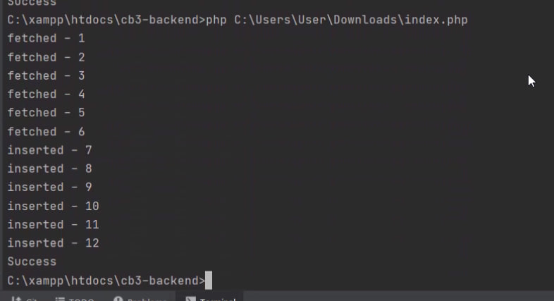

Вашему вниманию представлен код, который эмулирует подключение к БД 
и какие-то действия с ней.

Необходимо обеспечить корректную работу программы и полное чтение/запись данных из БД

Класс Database редактировать нельзя.
Вызовы методов (стр 93-100) редактировать нельзя.

